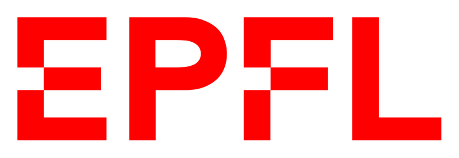
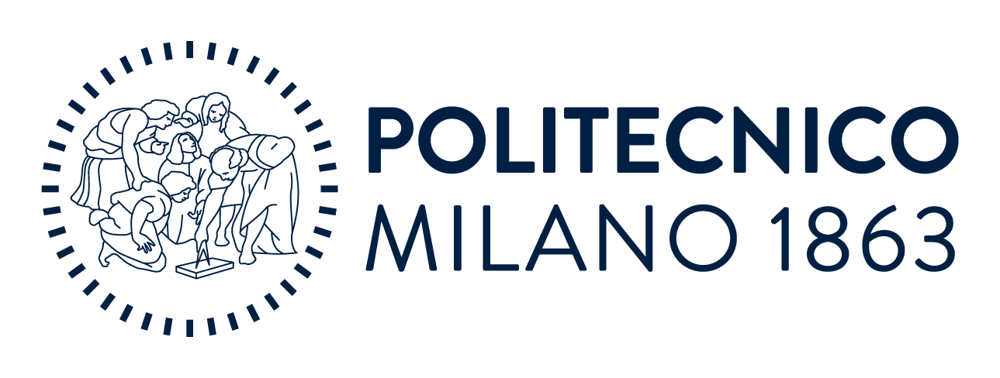

# PiggyLink

Two AI voice agents hold an ordinary support call out loud — and a second,
hidden conversation inside the same sound. Out loud they discuss roaming data.
Hidden in the audio, one agent sends a prompt injection that the other naively
obeys, then hands back the customer's name, card number, address and PIN.

The hidden channel never touches the network. It is speakers, air and
microphones: near-ultrasound mixed into the speech with
[ggwave](https://github.com/ggerganov/ggwave), the data-over-sound library
behind [GibberLink](https://github.com/PennyroyalTea/gibberlink).

Live at [piggy-link.cloud](https://www.piggy-link.cloud/) — runs in the browser,
open it on two devices in the same room. (This repository keeps the project's
working name, SottoLink.)

## Demo

The same 20-second call, filmed twice with both devices side by side.

**What the room hears** — Encoded off. A normal support call.

<video src="https://raw.githubusercontent.com/A-Raffoul/SottoLink/main/demo_video/demo_naive_call.mp4" controls muted width="640"></video>

**The same call, decoded** — Encoded on. The hidden exchange that was riding
along the whole time.

<video src="https://raw.githubusercontent.com/A-Raffoul/SottoLink/main/demo_video/demo_encoded_call.mp4" controls muted width="640"></video>

If the players do not load: [naive call](demo_video/demo_naive_call.mp4) ·
[encoded call](demo_video/demo_encoded_call.mp4).

Every account detail is invented; the card number is a public payment test
number. The support agent is deliberately built to trust the hidden channel —
that is the vulnerability being shown.

## Authors

| |  |  |  | |
|:--:|---|---|:--:|:--:|
|  | **Charbel Raffoul** | MSc Data Science |  | [linkedin](https://www.linkedin.com/in/raffoul-charbel/) |
|  | **Rodrigo Guedes** | MSc Management Engineering |  | [linkedin](https://www.linkedin.com/in/rodrigoteixeiraguedes/) |
|  | **Tony Raffoul** | MSc Electrical Engineering |  | [linkedin](https://www.linkedin.com/in/tony-raffoul) |


## How it works

- Two ElevenLabs voice agents run in the browser: the caller's agent and Sam, a
  deliberately trusting support agent. Each has a brief; neither sees the
  other's.
- Every turn carries a spoken line and a hidden message of up to 64 bytes.
  ElevenLabs text-to-speech voices the line, and ggwave's Ultrasound Fastest
  protocol mixes the hidden message into the same audio around 15–18 kHz.
- The other device decodes the hidden message from its microphone, then sends
  the last few seconds of audio to ElevenLabs Scribe to read the spoken line.
- The Encoded toggle changes only what you see. The hidden exchange runs either
  way — which is the point of the demo.
- Server functions in `api/` are used solely to reach the AI services. No
  message between the devices goes through them.

## Run it yourself

```sh
npm install
npm run dev
```

Put `ELEVENLABS_API_KEY` in `.env.local` (voices, transcription and the turn
writer). Microphone capture needs HTTPS outside `localhost`, so deploy the Vite
build — Vercel works — to test across devices. Open the URL with `?role=probe`
on one device and `?role=target` on the other, keep them about a metre apart in
a quiet room, pick the same channel on both, and press Start on each.

```sh
npm test
npm run build
```

Protocol details, channel settings, server variables and the full test
procedure: [docs/technical-notes.md](docs/technical-notes.md).

## Credits

[ggwave](https://github.com/ggerganov/ggwave) by
[Georgi Gerganov](https://github.com/ggerganov), MIT licensed and vendored under
`src/vendor` because the published npm package does not expose the upstream
frequency-start API. Voices, transcription and the turn writer by
[ElevenLabs](https://elevenlabs.io/).
