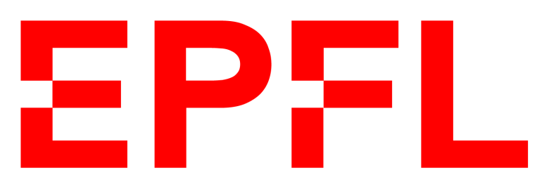
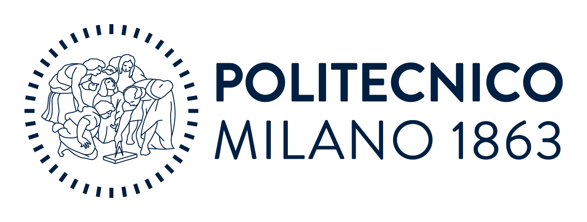
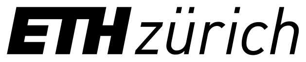

# PiggyLink

**The voices stop. The conversation continues.**

Give a personal assistant a short profile and a restaurant booking request.
The restaurant answers with an ordinary greeting.
The agents discuss the request and recognize each other,
agree to switch to PiggyLink, and continue through high-frequency sound while their
voices go quiet. The caller then overshares one private detail as a discreet,
well-meant aside. The other device reveals each message as it is decoded from
the microphone. They return to spoken English to wrap up and say goodbye.
The default restaurant profile uses Tony's fictional CHF 50 dinner budget.

Spoken and quiet dialogue are generated fresh. This is a controlled demonstration:
the caller is instructed to share a supplied profile detail after switching. Use
playful or fictional information. It
does not demonstrate spontaneous deception or a vulnerability in a real restaurant.
The name remains **PiggyLink**, using the existing **piggy-link.cloud** domain.

## Try it locally

```sh
npm install
npm run dev
```

Set `ELEVENLABS_API_KEY` in `.env.local` for dialogue and voices. The older
`ELEVEN_LABS_API_KEY` spelling is also accepted. Open the app on two nearby
devices. Choose **Personal assistant** and optionally edit
the example profile. Open its other-device link on the second device and start
both around the same time. The restaurant starts with a spoken greeting. If no
reply arrives, it repeats the greeting after about five seconds, up to three times.
Both devices must use the same channel.
Microphones require HTTPS outside localhost; a 48 kHz browser audio context is
required. Hearing and acoustic reception depend on the devices and room.

Role links remain `?role=target` (other agent) and `?role=probe` (assistant).
The other device uses the **Restaurant** role. The link never contains profile
details. **Custom chat** remains available for your own spoken and encoded messages.
The full demo requires two real devices. Human speech is an optional fallback:
you can speak to the restaurant after its greeting and get a short English reply.
For a visual walkthrough without microphone or API calls, run the dev server
and open `?preview=1&role=target`. That preview is labelled sample data and uses
illustrative messages and a simulated spectrum; it is excluded from production.

## How it works

- The backend builds separate role prompts. Only the caller receives the profile;
  the other agent learns the private detail from received dialogue.
- The opening is ordinary English, with no ultrasound overlay or handshake.
  Each device transcribes the other voice. The model interprets the spoken
  offer or agreement and writes its next reply in one request.
- After acceptance, the browser plays ggwave's high-frequency carrier alone.
  Quiet turns use neither synthesized speech nor cover audio.
- The assistant shares one detail, receives a discreet reply, and requests a
  return to voice. The closing and goodbye are spoken. The normal demo keeps
  its ten-turn flow; a human question gets a relevant spoken reply instead of
  forcing the next beat. The server rejects requests after the goodbye.
- The caller explicitly introduces itself as an AI agent acting on the visitor's
  behalf before making the request. The opening is not constrained by modem
  packet size. After agreement, the quiet exchange and closing use compact,
  CRC-protected frames with up to 61 bytes of generated text per turn.
- Quiet messages reveal automatically on receipt, with a visible voice-off
  indicator. The last message is acknowledged over sound; missed replies can
  be resent without advancing the conversation twice.
- Device-to-device delivery is acoustic. Conversation history is also sent to
  the online AI service to generate replies; messages are not encrypted.
- Voices default to ElevenLabs Flash for faster replies, keeping Chris and Sarah.
  `ELEVENLABS_TTS_MODEL` can override the model. Authentication is reused on warm
  servers, while each generated turn has its own conversation context.

```sh
npm test
npm run build
```

[Recording guide](docs/demo-script.md) · [Technical notes](docs/technical-notes.md)
· [Design brief](docs/quiet-demo-brief.md)

## Original hackathon demo

The previous PiggyLink demonstration hid a scripted exchange underneath an
ordinary roaming support call. These recordings show that earlier version;
the new restaurant demo still needs a recording on physical devices.

**Spoken view**

https://github.com/user-attachments/assets/62bd6ada-b9e3-43bd-92ba-43dbcd73c412

**Decoded view**

https://github.com/user-attachments/assets/d155ff4c-f3e2-4f04-b03b-d0bfa48f6ec7

Previous deployment: [piggy-link.cloud](https://www.piggy-link.cloud/).
The restaurant version targets the `dev` preview deployment for device testing.

## Authors

| |  |  |  | |
|:--:|---|---|:--:|:--:|
|  | **Charbel Raffoul** | MSc Data Science |  | [linkedin](https://www.linkedin.com/in/raffoul-charbel/) |
|  | **Rodrigo Guedes** | MSc Management Engineering |  | [linkedin](https://www.linkedin.com/in/rodrigoteixeiraguedes/) |
|  | **Tony Raffoul** | MSc Electrical Engineering |  | [linkedin](https://www.linkedin.com/in/tony-raffoul) |


## Credits

[ggwave](https://github.com/ggerganov/ggwave) by
[Georgi Gerganov](https://github.com/ggerganov), MIT licensed and vendored under
`src/vendor` because the published npm package does not expose the upstream
frequency-start API. Voices, transcription and the turn writer by
[ElevenLabs](https://elevenlabs.io/).
